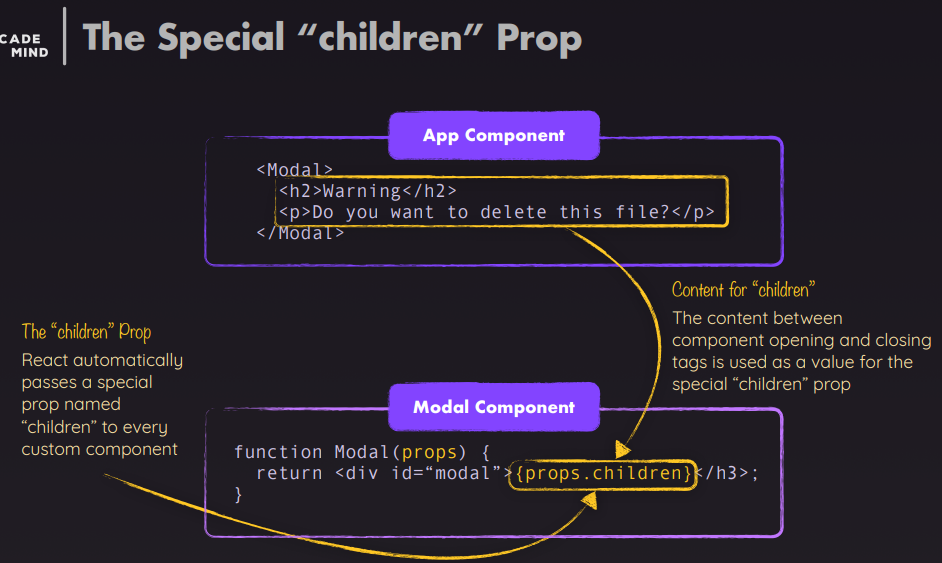
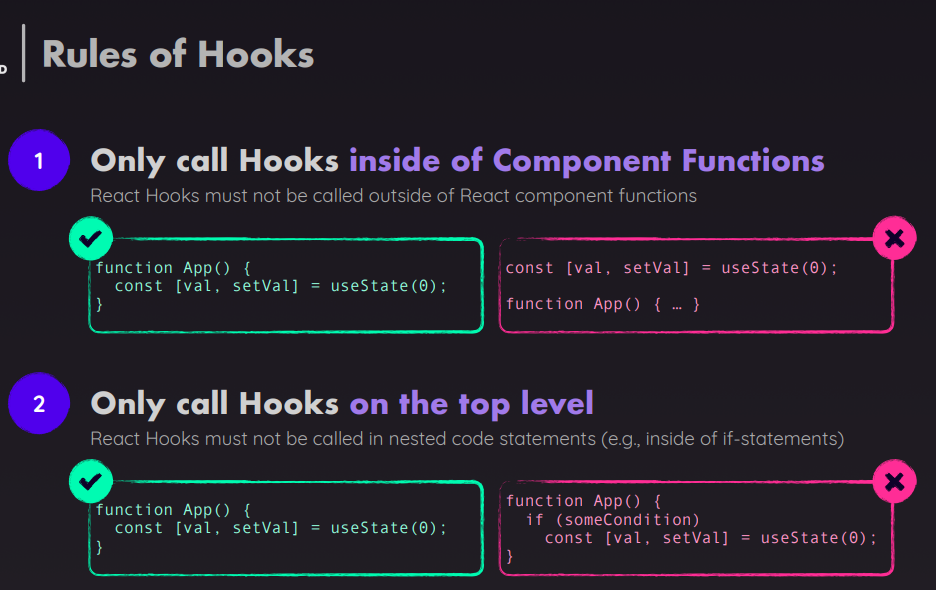

# React-Js

### React app creation

- `create-react-app` deprecated
- `vite` recommended

```bash
npm create vite@latest my-app --template react
```

### Component Functions Must Follow Two Rules

1. `Name Starts With Uppercase Character`
2. `Returns “Renderable” Content with one return expression`

### Built-in Components vs Custom Components


### Props Accept All Value Types


---

### props.children

- special prop that allows you to `pass components or elements between the opening and closing tags of a custom component`.
- It's often used to `create wrapper` or layout components.

```jsx
function Card(props) {
  return <div className="card">{props.children}</div>; // everything inside <Card>...</Card> (the <h1> and <p>) is passed into the Card component as props.children
}

// Usage
<Card>
  <h1>Hello</h1>
  <p>This is content inside the Card component.</p>
</Card>;
```

## 

### props.children vs props attribute

| Feature              | `props.children`                | Regular props (`props.foo`)        |
| -------------------- | ------------------------------- | ---------------------------------- |
| Automatically passed | ✅ Yes                          | ❌ No — you must explicitly define |
| Content type         | Usually JSX elements or strings | Any type (string, number, object…) |
| Use case             | Wrapping/nesting content        | Configuration/data passing         |

---

### Listeners

```jsx
function Button() {
  function handleClick() {
    alert('Button clicked!');
  }

  return <button onClick={handleClick}>Click Me</button>;
}

// onClick is the event listener
// handleClick is the event handler function
```

```jsx
function InputExample() {
  function handleChange(event) {
    console.log('Input value:', event.target.value);
  }

  return <input type="text" onChange={handleChange} />;
}
```

| Event Name     | When It Triggers             |
| -------------- | ---------------------------- |
| `onClick`      | When an element is clicked   |
| `onChange`     | When input value changes     |
| `onSubmit`     | When a form is submitted     |
| `onMouseEnter` | When mouse enters an element |
| `onKeyDown`    | When a key is pressed down   |
| `onFocus`      | When an element gains focus  |

---

### Passing Listeners as PROPS

```jsx
function Parent() {
  function handleButtonClick() {
    alert('Button clicked in Child!');
  }

  return <Child onButtonClick={handleButtonClick} />;
}
```

```jsx
function Child(props) {
  return <button onClick={props.onButtonClick}>Click Me</button>;
}
```

### Passing Event Handler with Parameters

```jsx
function Parent() {
  function handleItemClick(itemId) {
    alert(`Item clicked: ${itemId}`);
  }

  return (
    <div>
      <Child onItemClick={() => handleItemClick(1)} />
    </div>
  );
}
```

```jsx
function Child(props) {
  return (
    <div>
      <button onClick={onItemClick}>Item 1</button>
    </div>
  );
}
```

---

### When you try to update the UI in React without using state

1. `You change a variable directly — but React doesn't re-render`

```jsx
let counter = 0;

function Counter() {
  function handleClick() {
    counter++; // Update variable
    console.log(counter); // Logs updated value
  }

  return (
    <>
      <p>Counter: {counter}</p>
      <button onClick={handleClick}>Increment</button>
    </>
  );
}
```

- What happens?
  - Clicking the button changes the counter variable.
  - But the UI doesn't update because `React doesn't know it needs to re-render`.
- Why?
  - `React only re-renders when state (via useState) or props change.`
  - `Changing regular variables doesn't trigger a re-render.`

---

### Hooks

- special functions introduced in React 16.8
- Hooks let functional components do everything class components could

| Hook                                                   | Purpose                                                   |
| ------------------------------------------------------ | --------------------------------------------------------- |
| `useState`                                             | Adds state to functional components                       |
| `useEffect`                                            | Handles side effects (data fetching, subscriptions)       |
| `useContext`                                           | Access React context                                      |
| `useRef`                                               | Persist values across renders without causing re-renders  |
| `useMemo`                                              | Memoize expensive calculations                            |
| `useCallback`                                          | Memoize functions to prevent unnecessary re-renders       |
| `useReducer`                                           | For complex state logic (Redux-style)                     |
| `useLayoutEffect`                                      | Like `useEffect`, but fires synchronously after DOM paint |
| `useImperativeHandle`                                  | Customize instance exposed to parent with `ref`           |
| `useId`, `useSyncExternalStore`, `useTransition`, etc. | More advanced hooks                                       |

### Where Can Hooks Be Called?

- `At the top level of a React functional component`
- `Inside another custom hook`

```jsx
function MyComponent() {
  const [count, setCount] = useState(0); // ✅ valid  called in top level of a React functional component
}
```

```jsx
function useCustomLogic() {
  const theme = useContext(ThemeContext); // ✅ valid  called Inside another custom hook
}
```

### You CANNOT call hooks:

- `Inside loops, conditions, or nested functions`
- `Inside class components`
- `Outside of React components or hooks`

```jsx
// ❌ DON'T DO THIS
if (someCondition) {
  useEffect(() => {
    // Invalid! Hooks must be unconditional
  }, []);
}
```

```jsx
function handleClick() {
  useState(); // ❌ Invalid inside event handlers
}
```

## 

### What's the purpose of "State" in React apps?

- its the data when managed causes React to re-evaluate a component

---

### useState()

- `lets you add state to functional components`

```jsx
const [state, setState] = useState(initialValue);

// state: current state value
// setState: function to update the state
// initialValue: value used for the first render

const [count, setCount] = useState(0);
<button onClick={() => setCount(count + 1)}>Increment</button>;
```

### Why We See the Old Value in console.log After setState()

```jsx
const [count, setCount] = useState(0);

const handleClick = () => {
  setCount(count + 1);
  console.log(count); // 🛑 Logs OLD value!
};
```

`❓ Why?`

- setState() in React is `asynchronous`. That means:
- `It schedules an update`.
- The `actual state change (and re-render) happens after the function exits`.
- So in the console.log(count), you're logging the value before React has updated it.

| Concept                                | Explanation                                                  |
| -------------------------------------- | ------------------------------------------------------------ |
| **State is preserved across renders**  | React keeps the state between function calls                 |
| **State updates cause re-renders**     | Updating state tells React to re-render the component        |
| **State updates are async**            | You won’t see changes immediately after `setState()`         |
| **You must not mutate state directly** | Always use `setState` to update it                           |
| **Can be used multiple times**         | You can have multiple `useState` hooks in a single component |

❌ Mutating state directly

```jsx
state.count++; // Don't do this
setCount((prev) => prev + 1); // correct way
```

---

## Scheduling State Updates


```jsx
const [isEditing, setIsEditing] = React.useState(false);

function handleEditClick() {
  setIsEditing(!isEditing);
  setIsEditing(!isEditing);

  // we think with the above two lines we will get last value as false so nothing will change
  // but its not because if REACT STATE ARE SCHEDULED
}

function handleEditClick() {
  setIsEditing((editing) => !editing);
  setIsEditing((editing) => !editing);
  // here nothing will change and last value will be false
  // as both statement nullify
  // because here value is being changed based on prev value, here REACT STATE ARE SCHEDULED
}
```

---

### different ways to render the content in react conditionally

| Method                 | Use When                      | Example Syntax                   |
| ---------------------- | ----------------------------- | -------------------------------- |
| `if` / `else`          | Multi-branch or verbose logic | `if (isLoggedIn) { return ... }` |
| Ternary operator `? :` | Short inline conditional      | `{condition ? A : B}`            |
| `&&` logical operator  | One-way condition             | `{condition && A}`               |
| `switch`               | Multiple specific values      | `switch (value) { ... }`         |
| IIFE                   | Inline but with complex logic | `{(() => { ... })()}`            |
| Optional chaining      | Safe access to nested props   | `{user?.name}`                   |

```jsx
// if Statements (inside function)
function MyComponent({ isLoggedIn }) {
  if (isLoggedIn) {
    return <h1>Welcome back!</h1>;
  } else {
    return <h1>Please sign in.</h1>;
  }
}

// Ternary Operator
<p>{isLoggedIn ? "Logout" : "Login"}</p>
{isAdmin ? <AdminPanel /> : <UserPanel />}

// Logical AND (&&) Operator
{isLoading && <p>Loading...</p>}

// Switch Statements
function getContent(role) {
  switch (role) {
    case "admin":
      return <AdminDashboard />;
    case "user":
      return <UserDashboard />;
    default:
      return <GuestView />;
  }
}

// Immediately Invoked Function Expressions (IIFE)
{(() => {
  if (error) return <ErrorMessage />;
  if (loading) return <Spinner />;
  return <DataView />;
})()}

// Conditional Classes or Styles
<div className={isDark ? "dark-mode" : "light-mode"}></div>

// Using Optional Chaining
<p>{user?.name}</p>
```

---

### Fragment

- `used to group multiple elements without adding an extra node to the DOM`.
- Since `return can return only one statement`, we tend to wrap with some div, but div or any other tag gets rendered to dom, but fragment doesn't.
- `If you need to pass a key (especially in list rendering), you must use the long form`

```jsx
function App() {
  return (
    <h1></h1>
    <div></div> // ❌invalid as only one statement can be returned
  )
}

function App() {
  return (
    <div>
      <h1></h1>
      <div></div> // valid but div or any other tag gets rendered to dom
    </div>
  )
}

function App() {
  return (
    <React.Fragment>
      <h1></h1>
      <div></div> // ✅ valid as fragment is not rendered
    </React.Fragment>
  )
}

function App() {
  return (
    <>
      <h1></h1>
      <div></div> // ✅ valid Shorthand <>...</>
    </>
  )
}

function List() {
  return items.map(item => (
    <React.Fragment key={item.id}>
      <dt>{item.term}</dt>
      <dd>{item.description}</dd>  // If you need to pass a key (especially in list rendering), you must use the long form
    </React.Fragment>
  ));
}
```

---

### Forwarded Props [Proxy Props]

- `pattern where a component receives props and passes (forwards) them down to a child or underlying DOM element`, often without explicitly knowing or using them itself.

1. **Why**

- `Reusability`:
  - You can `build wrapper components (like buttons, inputs, modals)` that accept arbitrary props and pass them along.
- `Custom Styling/Behavior`:
  - Allows consumers to add custom props (like onClick, style, className, etc.) without modifying the wrapper.
- `Better Abstraction`:
  - Components can remain generic and flexible.

2. **How to Forward Props**

```jsx
function CustomButton(props) {
  return <button {...props} />;
}

<CustomButton onClick={handleClick} className="primary" />;
```

```jsx
function CustomInput({ label, ...rest }) {
  return (
    <>
      <label>{label}</label>
      <input {...rest} />
    </>
  );
}
```

3. ⚠️ **Limitations**

- `Prop Collisions`:
  - If the component uses a prop (e.g., className or onClick), blindly forwarding can override or duplicate it.
- `Harder Debugging`:
  - Overuse or careless forwarding can make components unpredictable.
- No Type Safety (in JS):
  - You may pass irrelevant props that aren't intended for the underlying component.
- `React.forwardRef Needed for ref`:
  - If you want to `forward a ref, you must explicitly use React.forwardRef`.

```jsx
const FancyInput = React.forwardRef((props, ref) => (
  <input ref={ref} {...props} />
));
```

```jsx
// example
function App() {
  return (
    <div id="content">
      <Input type="text" placeholder="Your name" />
      <Input richText placeholder="Your message" />
    </div>
  );
}

export default function Input({ richText, ...props }) {
  let content = <textarea {...props} />;

  if (richText) {
    content = <input {...props} />;
  }
  return <>{content}</>;
}
```

### multi jsx slot in react

- its similar to content projection in angular
- In React, this is mimicked using:
  - `props.children (default slot)`
  - `Custom named props for multiple slots`
  - `Render props or composition`

1. **Named Props as Slots**

```jsx
function Card({ header, body, footer }) {
  return (
    <div className="card">
      <div className="card-header">{header}</div>
      <div className="card-body">{body}</div>
      <div className="card-footer">{footer}</div>
    </div>
  );
}

// Usage:
<Card
  header={<h1>Title</h1>}
  body={<p>Main content here.</p>}
  footer={<button>Submit</button>}
/>;
```

2. **Using children as an Object**

```jsx
function Modal({ children }) {
  const { header, content, footer } = children;
  return (
    <div className="modal">
      <div className="modal-header">{header}</div>
      <div className="modal-content">{content}</div>
      <div className="modal-footer">{footer}</div>
    </div>
  );
}

// Usage:
<Modal>
  {{
    header: <h2>Welcome</h2>,
    content: <p>This is the main part</p>,
    footer: <button>Close</button>,
  }}
</Modal>;
```

3. **Composition with Static Sub-components**

```jsx
function Panel({ children }) {
  const header = React.Children.toArray(children).find(
    (child) => child.type === Panel.Header
  );
  const content = React.Children.toArray(children).find(
    (child) => child.type === Panel.Content
  );
  const footer = React.Children.toArray(children).find(
    (child) => child.type === Panel.Footer
  );

  return (
    <div className="panel">
      {header}
      {content}
      {footer}
    </div>
  );
}

Panel.Header = ({ children }) => <div className="panel-header">{children}</div>;
Panel.Content = ({ children }) => (
  <div className="panel-content">{children}</div>
);
Panel.Footer = ({ children }) => <div className="panel-footer">{children}</div>;

// Usage:
<Panel>
  <Panel.Header>Header Slot</Panel.Header>
  <Panel.Content>Main Slot</Panel.Content>
  <Panel.Footer>Footer Slot</Panel.Footer>
</Panel>;
```

---

### What Does {{ }} Mean in React?

| Syntax | Meaning                             |
| ------ | ----------------------------------- |
| `{}`   | Inject JavaScript into JSX          |
| `{{}}` | Inject an object (e.g. for `style`) |

```jsx
const styles = {
  color: 'red',
  fontSize: '20px',
};

function Example() {
  return <div style={styles}>Styled Text</div>;
}

// or directly
function Example() {
  return <div style={{ color: 'red', fontSize: '20px' }}>Styled Text</div>;
}

// Outer { ... } tells JSX: "I'm injecting JavaScript".
// Inner { ... } is the actual JavaScript object you're passing (e.g., a style object).
```

## Dynamic Component Types

1. ✅ Why?

- Build reusable `layouts that load components conditionally` (e.g. based on config, API data, or user input).
- `Avoid giant switch or if trees for conditional rendering`.
- Enable dynamic imports/code-splitting.

2. **How To Use Dynamic Component Types**

```jsx
// ✅ 1. Component Map + JSX
const components = {
  Text: ({ text }) => <p>{text}</p>,
  Button: ({ label }) => <button>{label}</button>,
};

function DynamicRenderer({ type, props }) {
  const Component = components[type];
  return Component ? <Component {...props} /> : <div>Unknown type</div>;
}

// Usage:
<DynamicRenderer type="Text" props={{ text: "Hello!" }} />
<DynamicRenderer type="Button" props={{ label: "Click Me" }} />
```

```jsx
//  2. Dynamic Imports (Lazy Loading)
const componentMap = {
  Chart: React.lazy(() => import('./Chart')),
  Table: React.lazy(() => import('./Table')),
};

function DynamicComponent({ type }) {
  const Component = componentMap[type];
  return Component ? (
    <React.Suspense fallback={<div>Loading...</div>}>
      <Component />
    </React.Suspense>
  ) : (
    <div>Not found</div>
  );
}
```

```jsx
// 3. Using a Tag Name as a String
function DynamicTag({ tag, children }) {
  const Tag = tag; // e.g., 'h1', 'div', 'section'
  return <Tag>{children}</Tag>;
}
// OR
function DynamicTag({ Tag, children }) {
  // const Tag = tag; // e.g., 'h1', 'div', 'section'
  return <Tag>{children}</Tag>;
}

// Usage:
<DynamicTag tag="h2">Heading</DynamicTag>;
```

---

## public/ vs assets/ for Image Storage

1. **public/**

- you can store images in the public/ folder and then `directly reference them from inside your index.html or index.css files`.
- images (or, in general: files) stored in public/ are `made publicly available by the underlying project development server & build process`. Just like index.html, those files can directly be visited from inside the browser and can therefore also be requested by other files.
- If you try `loading localhost:5173/some-image.jpg, you'll be able to see that image` (if it exists in the public/ folder, of course).

2. **src/assets/**

- store images in the src/assets/ folder (or, actually, anywhere in the src folder)
- Any files (of any format) stored in s`rc (or sub-folders like src/assets/) are not made available to the public`. They can't be accessed by website visitors. If you `try loading localhost:5173/src/assets/some-image.jpg, you'll get an error`.
- Instead, files stored in src/ (and subfolders) `can be used in your code files`. Images imported into code files are then `picked up by the underlying build process, potentially optimized, and kind of "injected" into the public/ folder right before serving the website`. Links to those images are automatically generated and used in the places where you referenced the imported images.

### Which Folder Should You Use?

- You should use the public/ folder for any `images that should not be handled by the build process and that should be generally available. Good candidates are images used directly in the index.html file or favicons`.

- On the other hand, `images that are used inside of components should typically be stored in the src/` folder (e.g., in src/assets/).

---
