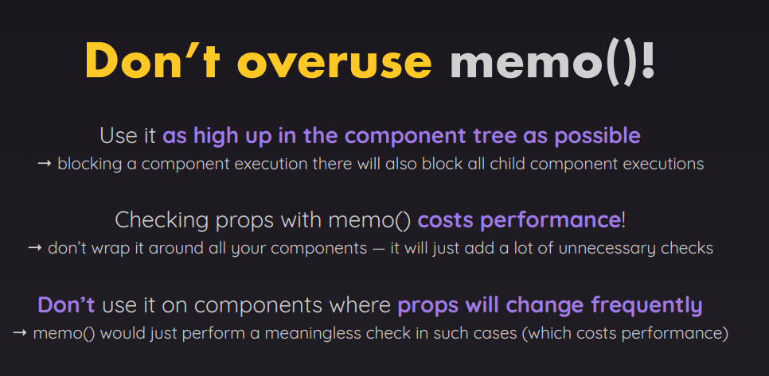

# Memo

1. higher-order component `(HOC) that memoizes a functional component`.
2. It `prevents re-rendering if the props haven’t changed`, optimizing performance — especially for pure components
3. Default comparison => props [prev props to current props] `shallow comparison of props`
4. can also provide custom comparison

```jsx
const MemoizedComponent = React.memo(MyComponent);

//provide a custom comparison function
const MemoizedComponent = React.memo(MyComponent, areEqual);

//example
function areEqual(prevProps, nextProps) {
  return prevProps.name === nextProps.name;
}

const MemoizedComponent = React.memo(MyComponent, areEqual);
```

```jsx
const Child = React.memo(({ name }) => {
  console.log('Child rendered');
  return <div>Hello {name}</div>;
});

function Parent() {
  const [count, setCount] = React.useState(0);

  return (
    <>
      <Child name="React" />
      <button onClick={() => setCount(count + 1)}>Increment</button>
    </>
  );
}
```

✅ What happens here?

- Even though the Parent re-renders on button click,
- the Child won’t re-render unless the name prop changes.



| Feature         | Purpose                     |
| --------------- | --------------------------- |
| `React.memo`    | Memoizes a component        |
| Shallow compare | Default comparison of props |
| `useCallback`   | Memoizes a function         |
| `useMemo`       | Memoizes a value            |

---
