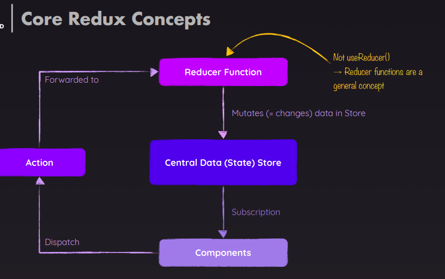
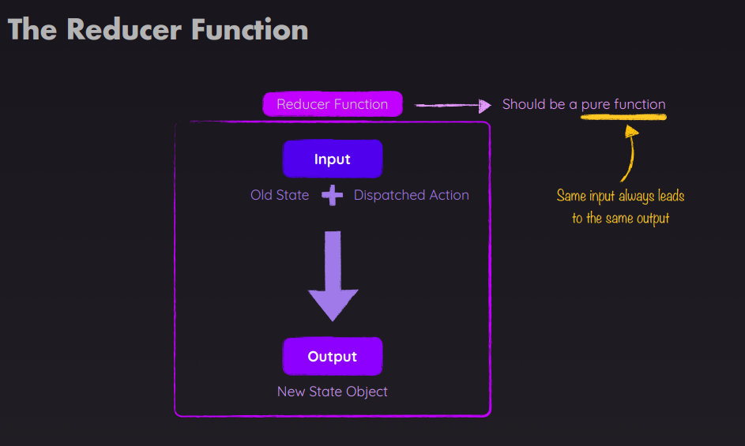
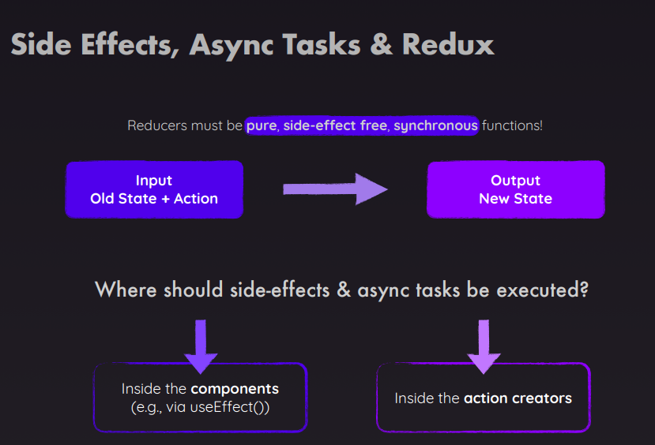
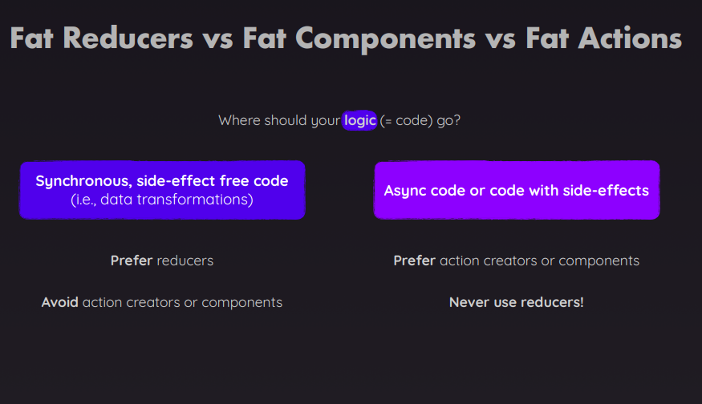

# Redux

## Redux vs UseContext

| Feature            | `useContext`                       | `Redux`                                              |
| ------------------ | ---------------------------------- | ---------------------------------------------------- |
| **Type**           | React built-in hook                | External state management library                    |
| **Best for**       | Small, simple global state         | Large, complex, or shared global state               |
| **Boilerplate**    | Very little                        | More setup and boilerplate                           |
| **DevTools**       | ❌ None built-in                   | ✅ Excellent DevTools support                        |
| **Middleware**     | ❌ Not supported directly          | ✅ Supports middleware (e.g. logging, async)         |
| **Performance**    | Re-renders all consumers on change | Fine-grained control with `connect()`                |
| **Async Logic**    | Manual via effects or custom hooks | Handled with Redux middleware like `thunk` or `saga` |
| **Learning Curve** | Very easy                          | Moderate to steep                                    |

## Redux core



## Reducer func

- will be executed when action is dispatched
- always has two param
  - `oldState`
  - `dispatchedActions` which will have action type and payloads
- it is accepted as a param by `createStore(reducer)`



## Sample example of basic redux in JS

```js
const redux =  require('redux');

const initialState = {
    counter: 0
}

const counterReducer = (state = initialState, action) = {
    if(action.type === 'increment') {
        return {
            ...state,
            counter = state.counter + 1
        }
    }
    if(action.type === 'decrement') {
        return {
            ...state,
            counter = state.counter + 1
        }
    }
    return state;
}

const store = redux.createStore(counterReducer);

const counterSubscriber = () = {
    const latestStoreState = store.getState();
    console.log(latestStoreState);
};

store.subscribe(counterSubscriber);

store.dispatch('increment');
store.dispatch('decrement');

// output
// counter: 1
// counter: 0
```

---

## React REdux [lib]

- `redux`
- `react-redux`
  - gives `<Provider></Provider>` component which will wrap the app which needs teh store access just like contextProvider using `useContext`
- redux-toolkit
  - `configureStore`
  - `createSlice`

```jsx
<Provider store={storeCreatedUsingRedux}>
  <App />
</Provider>
```

---

1. **react-redux**
   - `Provider`
   - `useSelector`
   - `useDispatch`
2. **redux-toolkit [@reduxjs/toolkit]**
   - `configureStore`
   - `createSlice`

---

## useSelector()

- To `select a piece of state from the Redux store`.
- To `re-render the component only when that slice of state changes`.
- `Replaces mapStateToProps from the HOC connect()` API.
- it `internally creates a subscription with store` which is required.

```js
const selectedState = useSelector(selectorFn);

//selectorFn: A function that takes the entire Redux store state and returns a slice of it.
```

### ⚠️ Important Notes

- `Avoid selecting the entire state like useSelector(state => state) — this causes re-renders on any state change`.
- You can use shallow comparison or useMemo to optimize performance if you're selecting objects or arrays.
- Each useSelector() is independent, so you can use multiple calls if needed.

---

## useDispatch()

- To `send actions to the Redux store to update state`.
- It's the hook-based `alternative to mapDispatchToProps from connect()` in class components

```jsx
const dispatch = useDispatch();

dispatch({ type: 'ACTION_TYPE', payload: data });
```

| Hook            | Purpose                      | Example Use                         |
| --------------- | ---------------------------- | ----------------------------------- |
| `useDispatch()` | Sends actions to Redux store | `dispatch(increment())`             |
| `useSelector()` | Reads state from Redux store | `useSelector(state => state.value)` |

---

```jsx
// store.js
const initialState = {
    counter: 0
}

const counterReducer = (state = initialState, action) = {
    if(action.type === 'increment') {
        return {
            ...state,
            counter = state.counter + 1
        }
    }
    if(action.type === 'decrement') {
        return {
            ...state,
            counter = state.counter + 1
        }
    }
    if(action.type === 'increase') {
        return {
            ...state,
            counter = state.counter + state.value
        }
    }
    return state;
}
```

```jsx
// Counter.js
import { useSelector, useDispatch } from 'react-redux';

function Counter() {
  const count = useSelector((state) => state.counter.value);
  const dispatch = useDispatch();

  const handleIncrement() {
    dispatch({
        type: 'increment'
    })
  }

  const handleDecrement() {
    dispatch({
        type: 'decrement'
    })
  }

  const handleIncrementBy5() {
    dispatch({
        type: 'increase',
        value: 5
    })
  }

  return (
    <div>
      <h2>Count: {count}</h2>
      <button onClick={handleIncrement}>+ Increment</button>
      <button onClick={handleDecrement}>− Decrement</button>
      <button onClick={handleIncrementBy5}>Increase By 5</button>
    </div>
  );
}
```

```jsx
import { Provider } from 'react-redux';
import { store } from './store';
import Counter from './Counter';

function App() {
  return (
    <Provider store={store}>
      <Counter />
    </Provider>
  );
}
```

---

# React-toolkit [@reduxjs/toolkit]

## 1. createSlice

- it simplifies
  - Writing constants for action types
  - Writing action creators
  - Writing switch-case logic in reducers
- `With createSlice(), Redux Toolkit generates all of this automatically` for you.

```jsx
import { createSlice } from '@reduxjs/toolkit';

const slice = createSlice({
  name: 'featureName', // Name for the slice
  initialState: {}, // Initial state
  reducers: {
    // Reducer logic (mutating is allowed via Immer)
    someAction: (state, action) => {
      /* update state */
      // for any payload `action.payload`
    },
  },
});

export const { someAction } = slice.actions; // returns Action creators
export default slice.reducer; // return Reducer
```

### 🧠 Under the Hood

- createSlice() `uses Immer, so you can "mutate" the state safely (it’s still immutable behind the scenes)`.
- **Returns**:
  - A reducer function for use in configureStore()
    - `const { someAction } = slice.actions`
  - Auto-generated action creators
    - `const reducer = slice.reducer`

## 2. configureStore

- It wraps around createStore from plain Redux and automatically:
  - `Combines reducers`
  - `Adds useful middleware` (redux-thunk, devtools, etc.)
  - Enables Redux DevTools
  - Adds good default settings for development

```jsx
// Syntax
import { configureStore } from '@reduxjs/toolkit';

const store = configureStore({
  reducer: {
    sliceName: sliceReducer,
    // more reducers...
  },
  middleware: (getDefaultMiddleware) =>
    getDefaultMiddleware().concat(customMiddleware),
  devTools: true, // enabled by default in development
});

| Option           | Purpose                                                    |
| ---------------- | ---------------------------------------------------------- |
| `reducer`        | Root reducer (object of slices or single reducer function) |
| `middleware`     | Add or customize Redux middleware stack                    |
| `devTools`       | Enable/disable Redux DevTools                              |
| `preloadedState` | Initialize store with predefined state                     |
| `enhancers`      | Add store enhancers like `applyMiddleware` (rarely needed) |

```

### example uf configureStore & createSlice

```jsx
// 1. Create Slice (counterSlice.js)
import { createSlice } from '@reduxjs/toolkit';

const counterSlice = createSlice({
  name: 'counter',
  initialState: { value: 0 },
  reducers: {
    increment: (state) => {
      state.value += 1;
    },
    decrement: (state) => {
      state.value -= 1;
    },
    incrementByAmount: (state, action) => {
      state.value += action.payload;
    },
  },
});

export const { increment, decrement, incrementByAmount } = counterSlice.actions;
export default counterSlice.reducer;
```

```jsx
// 2. Configure Store (store.js)
import { configureStore } from '@reduxjs/toolkit';
import counterReducer from './counterSlice';

export const store = configureStore({
  reducer: {
    counter: counterReducer,
  },
});
```

```jsx
import { useSelector, useDispatch } from 'react-redux';
import { increment, decrement, incrementByAmount } from './counterSlice';

function Counter() {
  const count = useSelector((state) => state.counter.value);
  const dispatch = useDispatch();

  return (
    <div>
      <h2>{count}</h2>
      <button onClick={() => dispatch(increment())}>+</button>
      <button onClick={() => dispatch(decrement())}>−</button>
      <button onClick={() => dispatch(incrementByAmount(5))}>+5</button>
    </div>
  );
}
```

```jsx
import { Provider } from 'react-redux';
import { store } from './store';
import App from './App';

function Root() {
  return (
    <Provider store={store}>
      <App />
    </Provider>
  );
}
```

| Traditional Redux                | Redux Toolkit with `configureStore()` |
| -------------------------------- | ------------------------------------- |
| Manual `createStore`, middleware | Automatic setup with smart defaults   |
| Needs `combineReducers()`        | Accepts an object of slice reducers   |
| Needs Redux DevTools extension   | Built-in support                      |

---

## Async/Side effects with Redux





### 1. Async via useEffect() in component

- adding the useEffect() in conjunction with useDispatch()
- since one `should not call side effects inside the reducer`, `reducer should be pure and sync`

```jsx
function App() {
  const dispatch = useDispatch();
  const showCart = useSelector((state) => state.ui.cartIsVisible);
  const cart = useSelector((state) => state.cart);
  const notification = useSelector((state) => state.ui.notification);

  useEffect(() => {
    const sendCartData = async () => {
      dispatch(
        uiActions.showNotification({
          status: 'pending',
          title: 'Sending...',
          message: 'Sending cart data!',
        })
      );
      const response = await fetch(
        'https://react-http-6b4a6.firebaseio.com/cart.json',
        {
          method: 'PUT',
          body: JSON.stringify(cart),
        }
      );

      if (!response.ok) {
        throw new Error('Sending cart data failed.');
      }

      dispatch(
        uiActions.showNotification({
          status: 'success',
          title: 'Success!',
          message: 'Sent cart data successfully!',
        })
      );
    };

    if (isInitial) {
      isInitial = false;
      return;
    }

    sendCartData().catch((error) => {
      dispatch(
        uiActions.showNotification({
          status: 'error',
          title: 'Error!',
          message: 'Sending cart data failed!',
        })
      );
    });
  }, [cart, dispatch]);

  return (
    <Fragment>
      {notification && (
        <Notification
          status={notification.status}
          title={notification.title}
          message={notification.message}
        />
      )}
      <Layout>
        {showCart && <Cart />}
        <Products />
      </Layout>
    </Fragment>
  );
}
```
